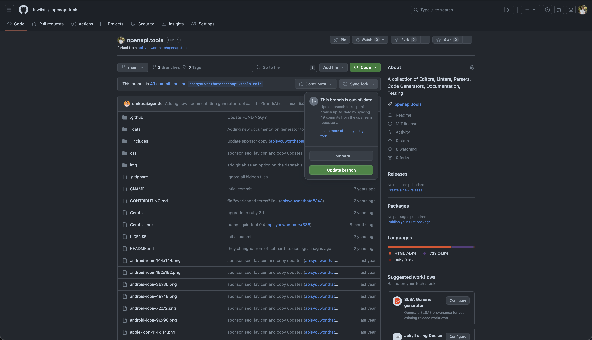

## 🐱 Git

## Обновить форк

Если вы ранее уже форкали репозиторий, и делали пулл реквест на github для стороннего репозитория

то можно прямо в github на странице форка нажать `Sync fork` и затем `Update branch`

после этого можно локально перейти в ветку master `git checkout master` и спулить `git pull` новые коммиты

а так же не забудьте, если вы переносите репку гема
* обновить его homepage для страницы в rubygems

и если по старой ссылке сохраняете форк то лучше
* в нем написать что он неактуален
* дать ссылку
* отправить в архив
