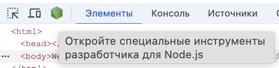
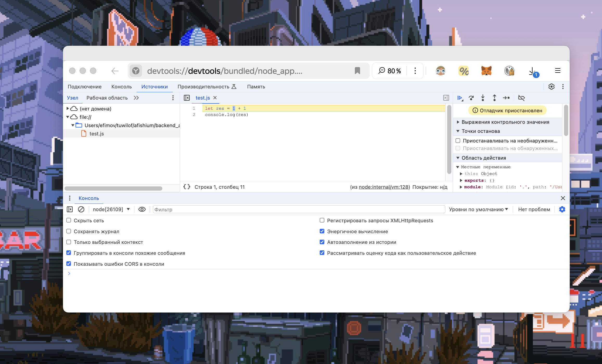
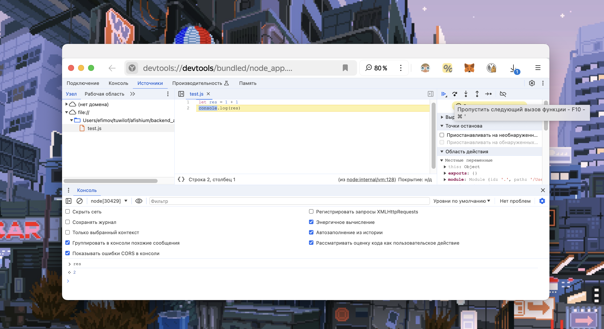
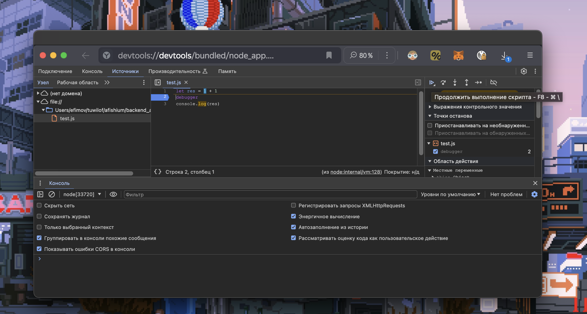
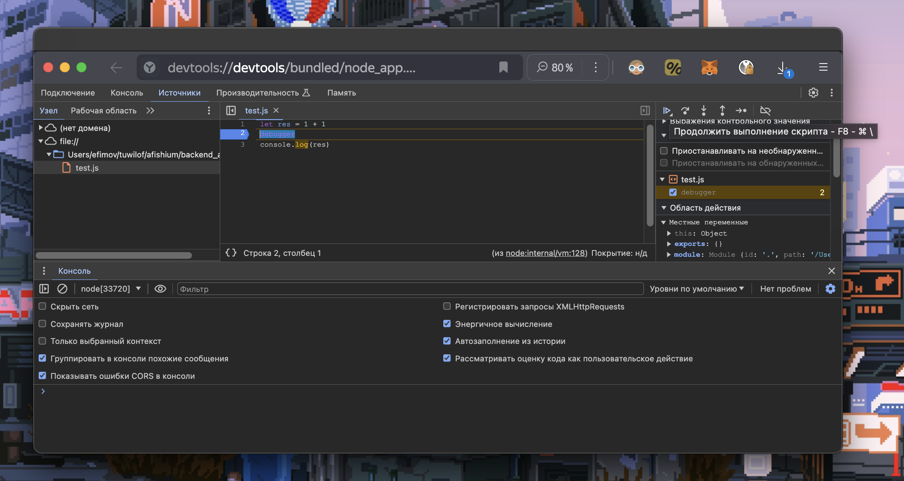

## 🍀 Node

### Дебаг

#### Основное

* Запускаем `node` для нужного файла с настройкой `--inspect-brk`

```sh
node --inspect-brk test.js 
```

* открываем страницу http://127.0.0.1:9229/ или любую другую

* запускаем DevTools

* находим значок Node, нажимаем на него



* теперь можно дебажить



* а так же можно 
    * переходить к следующему шагу
    * смотреть вывод в консоли
    * выводить значение переменных в консоли



#### Точка останова

Так же как и в целом дебаг

```sh
node --inspect-brk test.js 
```

http://127.0.0.1:9229/

только для установки точки останова breakpoint можно как
* указать в коде заранее строчку `debugger`
* так и в интерфейсе



по умолчанию указатель будет на начале, надо будет нажать далее


